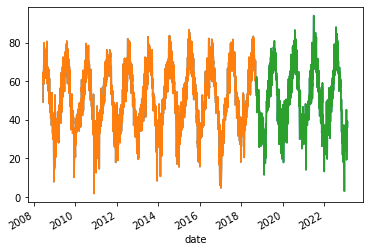
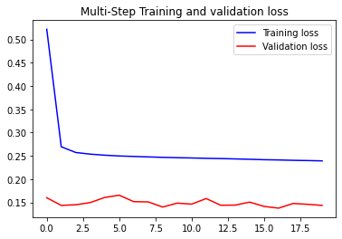
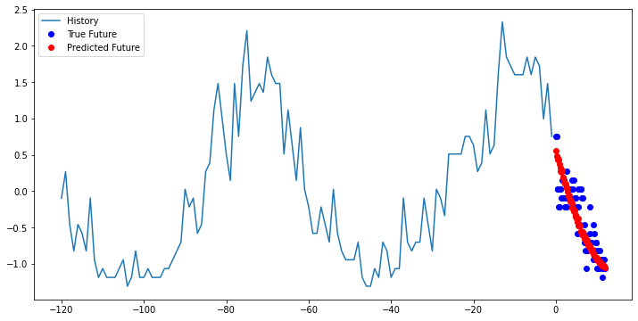
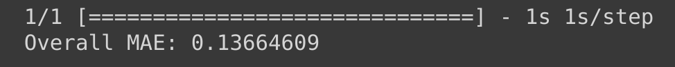

## Welcome to my Machine Learning Projects!

### Types of Neural Networks
There are two primary types of neural networks used today: recurrent and convolution.

The main difference between them is that the math theory behind recurrent neural networks (RNN) is specialized
to allow for the user to analyze data that appears in sequences- where the data at one point in time is dependent
on the data at another point in time. Convolution neural networks (CNN) on the other hand, are best used for computer 
vision applications where we are trying to identify a object or pattern in images.

**An example of RNN:** Traffic patterns in a city are a wonderful example of data that is dependent on every previous
data point because traffic does not magically appear in a city. There are rythms and flows to traffic patterns that
are determined by human patterns of movement. For example we commonly talk about "rush hour" traffic in cities, and
we expect there to be a morning an evening rush hour when people are heading to work and coming home from work. If
we collected traffic data before and after the rush hours we would see a clear trend when traffic starts to build, 
and we can use recurrent neural networks to model and predict future traffic patterns.

### Using RNN for Multivariate Time Series Forecasting
[Check out the Notebook for this project](https://colab.research.google.com/drive/1QsdqVt8txMdwOjQUQnafxyBEBDoOSOPq?usp=sharing)

#### Building our Pipeline
**1. Data Processing and Cleaning**
We're going to start by importing packages
``` python
from datetime import datetime, timedelta
import numpy as np
import pandas as pd
import matplotlib.pyplot as plt
import tensorflow as tf
```

Now let's grab our dataset. For this model, we are working with weather data from my local area in Yakima, WA.
[Found here](https://raw.githubusercontent.com/BeeDrHU/Introduction-to-Python-CSPC-323-/main/ahtanum_combined2.csv)
``` python
##Bringing in our dataset
url= 'https://raw.githubusercontent.com/BeeDrHU/Introduction-to-Python-CSPC-323-/main/ahtanum_combined2.csv'
data = pd.read_csv(url, sep=',')
data.head()
```

Next step is to filter the data and reset our index position
``` python
##Filtering and Cleaning
data= data[['date','Avg_F', 'Avg1.5m_DP', 'Avg1.5m_RH', 'Avg_Speedmph', '2m_MaxGustmph', 'TotPrecin', 'TotalSolarRad', 'EToin']]
data['date'] = pd.to_datetime(data['date'], format='%Y/%m/%d')
data = data.set_index('date')
data = data.sort_index()
data.head()
```

With that taken care of, let's take one more look at the data to make sure it's in good shape and meets our standards.
``` python
##Checklist and Quality Assurance
data.isnull()
print(f'Number of rows with missing values: {data.isnull().any(axis=1).mean()}')
data.info()
```

I'm happy with how it looks. Now that our dataset is taken care of, we are ready to start dividing the data up
into our testing and training data for building our RNN.
```python
##Subsetting the dataset
df= data['Avg_F']

df.plot()

##Train and Test Split
msk= (df.index < df.index[-1]- timedelta(days=1607))

df_train= df[msk].copy()
df_test= df[~msk].copy()

##Visualize the splits
df_train.plot()
df_test.plot()
```

Taking a look at our new training and testing data, we can see that ~70% of the data is being put towards training and
~30% towards testing. 

Now let's normalize our data and subset our independent features.
```python
##Normalizing our data
uni_data= df.values.astype(float)

df_train= int(len(df_train))

uni_train_mean= uni_data[:df_train].mean()
uni_train_std= uni_data[:df_train].std()

uni_data= (uni_data-uni_train_mean)/uni_train_std

##Subset features
features_considered = ['TotalSolarRad', 'EToin', 'Avg1.5m_RH']

features = data[features_considered]
features.index = data.index

##Normalize features
dataset = features.values

data_mean = dataset[:df_train].mean(axis=0)
data_std = dataset[:df_train].std(axis=0)

dataset = (dataset-data_mean)/data_std
```

**2. Model Selection**

We know that we want to use a RNN, but there are multiple forms of RNNs. In this example, we want a RNN that has
the capability of processing long-term temporal information. For that reason we will be building a RNN with 
long-short term memomry (LSTM).

Let's start by defining a basic function to build our model:
```python
##Defining Function to Build Multivariate Data Structure
def multivariate_data(dataset, target, start_index, end_index, history_size,
                      target_size, step, single_step=False):
  data = []
  labels = []

  start_index = start_index + history_size
  if end_index is None:
    end_index = len(dataset) - target_size

  for i in range(start_index, end_index):
    indices = range(i-history_size, i, step)
    data.append(dataset[indices])

    if single_step:
      labels.append(target[i+target_size])
    else:
      labels.append(target[i:i+target_size])

  return np.array(data), np.array(labels)
  
##Define the Multi-step Plotting Structure
def multi_step_plot(history, true_future, prediction):
  plt.figure(figsize=(12, 6))
  num_in = create_time_steps(len(history))
  num_out = len(true_future)

  plt.plot(num_in, np.array(history[:, 1]), label='History')
  plt.plot(np.arange(num_out)/STEP, np.array(true_future), 'bo',
           label='True Future')
  if prediction.any():
    plt.plot(np.arange(num_out)/STEP, np.array(prediction), 'ro',
             label='Predicted Future')
  plt.legend(loc='upper left')
  plt.show()
  ```
  
  **3. Turning the Model on**
  
  Now with our basic model built, we can turn it on and start working with it:
  
  ```python
  ##Model Setup
past_history= 720
future_target = 72
STEP= 6

df_val = len(dataset) - past_history - future_target

x_train_multi, y_train_multi = multivariate_data(dataset, dataset[:, 1], 0,
                                                 df_train, past_history,
                                                 future_target, STEP)
x_val_multi, y_val_multi = multivariate_data(dataset, dataset[:, 1],
                                             df_train, df_val, past_history,
                                             future_target, STEP)
```

We've got the data divided and set up for modeling. Now let's build the architecture:
```python
##Adding Layers Due to Complexity
train_data_multi = tf.data.Dataset.from_tensor_slices((x_train_multi, y_train_multi))
train_data_multi = train_data_multi.cache().shuffle(BUFFER_SIZE).batch(BATCH_SIZE).repeat()

val_data_multi = tf.data.Dataset.from_tensor_slices((x_val_multi, y_val_multi))
val_data_multi = val_data_multi.batch(BATCH_SIZE).repeat()


multi_step_model = tf.keras.models.Sequential()
multi_step_model.add(tf.keras.layers.LSTM(32,
                                          return_sequences=True,
                                          input_shape=x_train_multi.shape[-2:]))
multi_step_model.add(tf.keras.layers.LSTM(16, activation='relu'))
multi_step_model.add(tf.keras.layers.Dense(72))

multi_step_model.compile(optimizer=tf.keras.optimizers.RMSprop(clipvalue=1.0), loss='mae')
```
This step adds layers to our model sequentially. In this case, we build a model that has LSTM-->LSTM-->Dense layers.

**4. Train/fit the Model**

Now that we have the model built and compiled, we can traing our model on the datasets that we have previously
subdivided and specified.
```python
##Train the Model
multi_step_history = multi_step_model.fit(train_data_multi, epochs=EPOCHS,
                                          steps_per_epoch=EVALUATION_INTERVAL,
                                          validation_data=val_data_multi,
                                          validation_steps=50)
```

This sequence of code will train the model for 20 generations (Epochs) and 200 time steps per generation. To visualize the 
results of this training, we're going to plot the training lost vs validation loss.

```python
##Define Function to Plot training and Validation over Time
def plot_train_history(history, title):
  loss = history.history['loss']
  val_loss = history.history['val_loss']

  epochs = range(len(loss))

  plt.figure()

  plt.plot(epochs, loss, 'b', label='Training loss')
  plt.plot(epochs, val_loss, 'r', label='Validation loss')
  plt.title(title)
  plt.legend()

  plt.show()

##Plot Training Results Over Time
plot_train_history(multi_step_history, 'Multi-Step Training and validation loss')
```


What we can see is that our training loss rapidly declines and our validation loss does not change much. Overall,
it's clear that there is still error in the model and the model could be improved by optimizing the hyperparameters.

**5. Make Predictions from Model**

Before we do any improving of our model, let's make predictions off the current model to see how accurate our model prediction is
in comparison to our testing dataset.

```python
##Predict Future Data
for x, y in val_data_multi.take(3):
  multi_step_plot(x[0], y[0], multi_step_model.predict(x)[0])
```



Now looking at these graphs, we can see that the predicted points in red are accurately predicting the trend of the data
but we also can see that the true data point habe more range or variation from the predicted points than what the model is capturing.

Honestly, the model right now doesn't seem to be that bad of a fit. However, there are still opportunities to improve it.
Let's check the models accuracy numerically.

**6. Check Model Accuracy**
```python
#Evaluate the model on the test data
test_data_multi = tf.data.Dataset.from_tensor_slices((x_val_multi, y_val_multi))
test_data_multi = test_data_multi.batch(BATCH_SIZE)

# Define the number of steps in the test dataset
steps = len(test_data_multi)

mae_values = []
for x, y in test_data_multi:
  x_val, y_val= x[:, :-1], y[:,-1]
  #Make predictions using the model
  y_pred_multi = multi_step_model.predict(x_val, steps=steps)

  #Compute MAE
  mae = tf.keras.metrics.mean_absolute_error(y_val_multi, y_pred_multi).numpy()
  mae_values.append(mae)

overall_mae = np.mean(mae_values)
print('Overall MAE:', overall_mae)
```


When we calculate the mean absolute error of our model, we get a overall error rate of 13.66%. Honestly, not to bad
for one round of training and no hyperparameter optimization. 

If we wanted to, we could use a grid search to optimize our hyperparameters and get the mean absolute error down below 1%.
One of the issues with this is that we may end up over-fitting the data, and that's only one of the issues you have to be aware of.
There is a lot of responsibility on the modelers part to make sure you are acccurately representing your data, and not misinterpreting your results.

### Thanks for following along with my tutorial! You are welcome to check out my Github or other projects to see more of my work.
